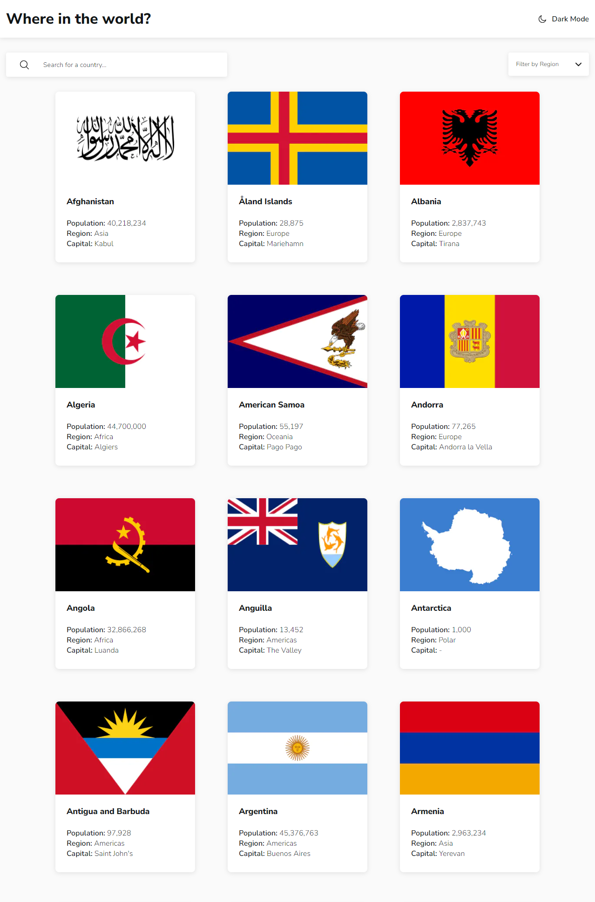
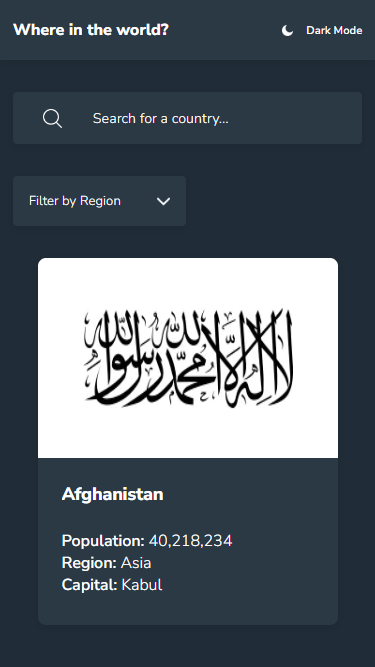

# Frontend Mentor - Aplicativo gerador de conselhos

Essa é uma solução para o [desafio do aplicativo REST Countries API with color theme switcher que está disponível no site Frontend Mentor](https://www.frontendmentor.io/challenges/advice-generator-app-QdUG-13db).

## Índice

- [Visão geral](#visão-geral)
  - [O desafio](#o-desafio)
  - [Captura de tela](#captura-de-tela)
  - [Links](#links)
- [Meu processo](#meu-processo)
  - [Construído com](#construído-com)
- [Autor](#autor)

## Visão geral

### O desafio

Os usuários devem ser capazes de:

- Veja todos os países da API na página inicial
- Pesquise um país usando um campo `input`
- Filtrar países por região
- Clique em um país para ver informações mais detalhadas em uma página separada
- Clique nos países fronteiriços na página de detalhes
- Alternar o esquema de cores entre o modo claro e escuro

### Captura de tela

### Links

- URL do repositório: [https://github.com/eduardosantanna/rest-countries](https://github.com/eduardosantanna/rest-countries)
- URL do site: [https://rest-countries-one-gold.vercel.app](https://rest-countries-one-gold.vercel.app)

## Meu processo

### Construído com

- [Next.js](https://nextjs.org)
- [Axios](https://axios-http.com)
- [API - restcountries.com](https://restcountries.com)
- [Vanilla-Extract](https://vanilla-extract.style)

## Autor

- Frontend Mentor - [@LuisZEdu](https://www.frontendmentor.io/profile/LuisZEdu)
